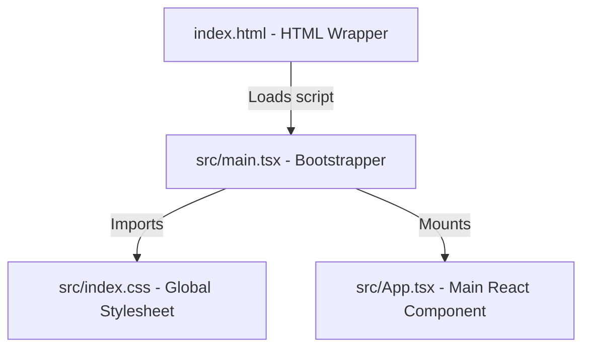

# Step 0 Code Explanation

In this step, we ran the Vite initialization command to create a React + TypeScript frontend application. Here is an explanation of the files generated, what they do, and how they relate to concepts you know from C++.

---

## 🏗️ The Application Boot Process

Like a C++ application which begins at the `main()` function, a React web application has a structured boot process:



### 1. `index.html` (The Shell)
* **What it is:** The index page the browser loads when visiting the site.
* **C++ Analogy:** The OS application loader wrapper.
* **Inside the file:** You will see a container element `<div id="root"></div>` and a `<script type="module" src="/src/main.tsx"></script>` tag. The script is what loads our code, and the `#root` div is the target container where React will draw the UI.

### 2. `src/main.tsx` (The Entry Point / `main()`)
* **What it is:** The bootstrap script that initializes React.
* **C++ Analogy:** The standard `int main(int argc, char* argv[])` function.
* **Inside the file:**
  ```typescript
  import { StrictMode } from 'react'
  import { createRoot } from 'react-dom/client'
  import './index.css'
  import App from './App.tsx'

  createRoot(document.getElementById('root')!).render(
    <StrictMode>
      <App />
    </StrictMode>,
  )
  ```
  - `createRoot(document.getElementById('root')!)`: Locates the `#root` container in our `index.html` and instantiates the React Virtual DOM root engine.
  - `.render(...)`: Renders our main root React component (`<App />`) into the page.
  - `<StrictMode>`: A helper wrapper that checks for potential bugs in code during development (similar to compiler warning flags like `-Wall`).

### 3. `src/App.tsx` (The Root Component)
* **What it is:** The main UI component of our application.
* **C++ Analogy:** The main application window class / UI root widget.
* **Inside the file:** We simplified it to output a basic greeting:
  ```typescript
  import React from 'react';

  function App() {
    return (
      <div style={{ ... }}>
        <h1>Capitalism Notebook</h1>
        <p>Step 0: Setup Complete!</p>
      </div>
    );
  }

  export default App;
  ```
  - `App` is a standard TypeScript function that returns JSX/TSX. JSX is a syntax extension that allows writing HTML-like structures directly in TypeScript.
  - `export default App` makes this component importable by other files (similar to marking a class or function as `public` in a header file).

### 4. `src/index.css` (Global Styling)
* **What it is:** Global CSS rules that apply to the entire website.
* **C++ Analogy:** Style variables or themes applied globally to your window manager.
* **Inside the file:** We have a clean CSS reset that ensures consistent margin/padding behaviors across all browsers, sets the canvas background color to `#2d2c32` (from the Figma design), and sets up standard viewport alignment.

---

## ⚙️ Configuration Files (Project Control)

### 1. `package.json` (The Dependency Manager)
* **What it is:** Declares metadata, dependency libraries, and scripts.
* **C++ Analogy:** `CMakeLists.txt` or a `.vcxproj` file.
* **Inside the file:**
  - `dependencies`: Libraries needed to run the application (like `react` and `lucide-react`).
  - `devDependencies`: Tools needed only for building and testing the code (like `typescript`, `vite`, `eslint`).
  - `scripts`: CLI aliases (e.g. `npm run dev` starts the Vite local server; `npm run build` compiles code for release).

### 2. `tsconfig.json` & `tsconfig.app.json` (Compiler Options)
* **What it is:** Configuration files for the TypeScript compiler (`tsc`).
* **C++ Analogy:** Compiler flag configurations (e.g., `-std=c++20`, optimization flags).
* **Inside the file:** Sets compile-time checks, target JavaScript version, module resolution paths, and library files.

### 3. `vite.config.ts` (Build Tool Options)
* **What it is:** Configures how Vite bundles and serve files.
* **C++ Analogy:** Makefile / build tool options.
* **Inside the file:** Standard configuration loading the React plugin to compile `.tsx` JSX syntax into standard JavaScript.
